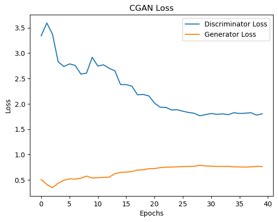
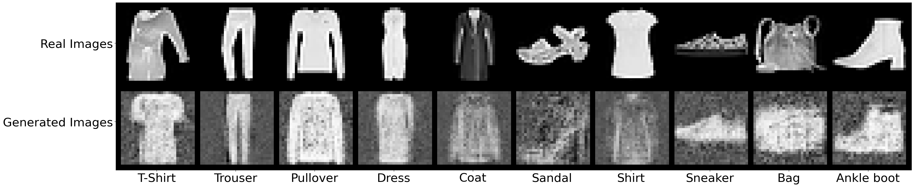

# Flask API for Conditional GAN on FashionMNIST

This repository contains the code for a Flask API which retrieves a generated image corresponding to the class from a Conditional GAN trained on FashionMNIST dataset.

Conditional GAN research paper can be find [here](https://arxiv.org/abs/1411.1784)

<p style="font-size:250%;" align = "center">Loss Function for Conditional GAN</p>

<p align = "center">

</p>

## Installation

```setup
git clone https://github.com/Ankit2527/Sensity_Project_ConditionalGAN.git
cd Sensity_Project_ConditionalGAN/
```

Note: 
1. Sensity_Project_ConditionalGAN/CGAN/ contains the saved generator and discriminator model files.
2. Sensity_Project_ConditionalGAN/template/ contains the html file for flask api
   
## Environment Setup

A conda environment is provided that installs all the required packages. The environment `sensity_env.yml`installs all packages that only supports GPU.

It is recommended to use conda for installing the requirements. If you haven't installed conda yet, you can find instructions [here](https://www.anaconda.com/products/individual). 

The steps for installing the requirements are:

1. Create a new environment
   ```setup
   conda env create -f sensity_env.yml
   ```
   
2. Activate the environment
   ```setup
   conda activate sensity.env
   ```

## Hyperparameters used for this Implementation

Hyperparameters chosen for this implementation are as follows
* mini-batch size: 32
* learning rate: 0.0001
* Optimizer: Adam  
* number of epochs: 40
* noise dimension = 64


## Training the Conditional GAN model

To run tests, run the following command

```bash
  python main.py --num_epochs 40
```

To run the model for less number of epochs replace 100 by the number of epochs as desired. The generator and discriminator models are saved after each epoch

By default, GPU is used for training if available. Training the CGAN model takes around 13 minutes on a NVIDIA GeForce GTX 2080 Ti GPU.

**Loss Curves**
<p align="center">

</p>

From the loss curve it can be observed that the with increasing number of epochs the  generator loss decreases while the discriminaor loss increases, although the generator loss is quite high so it will be fairly easy for the discriminator to indentify the real and fake (generated) images.


## Real and Generated Images(after 40 epochs)

<p align="center">

</p>


## Running Unnittest

To run unnitest, run the following command

```bash
  python unnitests.py 
```
## Running the Flask API

To run Flask API to display a generated image from CGAN, run the following commands in order:

   ```setup
   set FLASK_APP=flask_cgan.py
   ```

   ```setup
   set FLASK_ENV=development
   ```

   ```setup
   flask run
   ```

   Upon running the last command, the Flask app will be served on the following local host:
   ```setup
   http://127.0.0.1:5000
   ```
   Additional details to generate an image of a particular class  is provided on the local host page.

   Note: Press Ctrl + C in the command line to quit.
   
